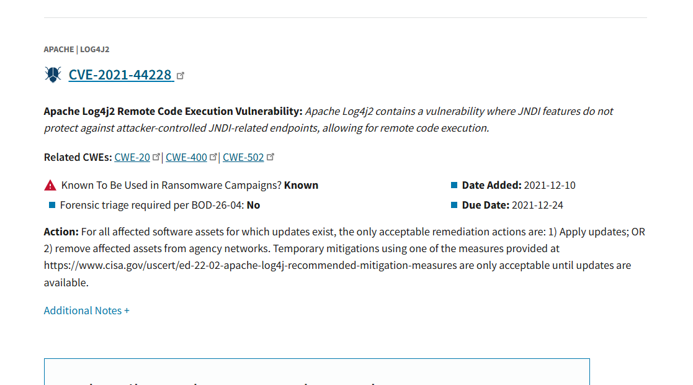
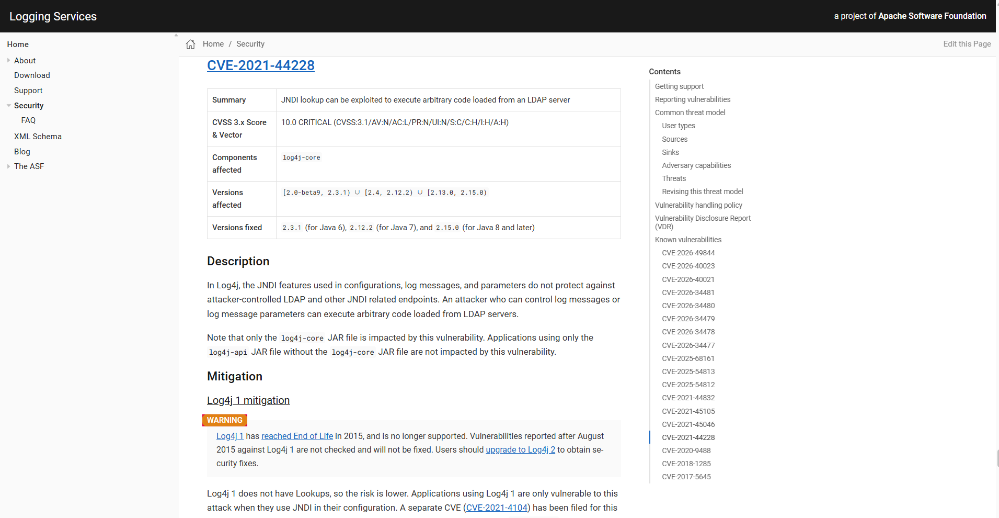

# KEV Catalogの基礎と使い方

公開日：2026年8月27日

## はじめに
公開されるCVEは非常に多く、そのすべてに同じ優先度で対応するのは現実的ではありません。

そこで実際の攻撃で使われている脆弱性を見分けるための判断材料として使用されるのが、米国のCISAが公開しているKEV Catalogです。

この記事では、KEVの意味、KEV Catalogへの登録基準、公開されているデータ、脆弱性管理での使い方について、記載します。

## KEVとは

KEVは **Known Exploited Vulnerabilities** の略で、日本語では「既知の悪用された脆弱性」などと訳されます。

KEVは、脆弱性を新しく識別するための番号ではなく、実際の攻撃で悪用されたことが確認されている脆弱性を表す呼び方です。

## KEV Catalogとは

米国のCybersecurity and Infrastructure Security Agency（CISA）は、実際の攻撃で悪用されたことが確認されている脆弱性をまとめた[Known Exploited Vulnerabilities Catalog（KEV Catalog）](https://www.cisa.gov/known-exploited-vulnerabilities-catalog)を管理しています。

KEV Catalogは、CVEが発行された脆弱性のうち、実際の攻撃で悪用されたことについて信頼できる証拠があるものをCISAが整理して公開するカタログです。各脆弱性はCVE IDを基準に登録され、影響を受ける製品や求められる対応などの情報も掲載されます。

このカタログを参照することで、組織は多数のCVEの中から、すでに現実の脅威となっている脆弱性を特定し、対応の優先順位を判断できます。

KEV Catalogは、CISAの公式サイトで公開されています。

- [KEV CatalogのWebページ](https://www.cisa.gov/known-exploited-vulnerabilities-catalog)
- [JSON形式](https://www.cisa.gov/sites/default/files/feeds/known_exploited_vulnerabilities.json)
- [CSV形式（CISA公式GitHubミラー）](https://github.com/cisagov/kev-data/blob/develop/known_exploited_vulnerabilities.csv)

Webページでは、CVE ID、製品名、ベンダー名などで検索できます。JSONとCSVは、脆弱性管理ツールへの取り込みや、スキャナーの検出結果との自動照合に利用できます。

簡単に整理すると、CVEとKEV Catalogの関係は次のようになります。

| 項目 | CVE | KEV Catalog |
| --- | --- | --- |
| 主な目的 | 脆弱性を共通のIDで識別する | 実際に悪用された脆弱性を示す |
| 対象 | 公開された脆弱性全般 | CVEのうち登録基準を満たすもの |
| 管理 | CVE Program | CISA |
| 判断できること | どの脆弱性について話しているか | 実際の攻撃で悪用された実績があるか |

既存のCVEに対して、「この脆弱性は実際に悪用されたことが確認されている」という情報を付加するカタログになります。

## KEV Catalogへの登録条件

CISAは、KEV Catalogへの登録条件として、次の3点を示しています。

1. CVE IDが割り当てられていること
2. 実際に悪用されたことについて信頼できる証拠があること
3. 明確な対処方法が存在すること

この3つをすべて満たした脆弱性が、KEV Catalogへの追加対象になります。

### 1. CVE IDが割り当てられている

KEV CatalogはCVEを基準に管理されているため、対象の脆弱性にはCVE IDが必要です。

脆弱性が実際に悪用されていても、CVE IDがまだ発行されていなければ、その時点ではKEV Catalogの登録条件を満たしません。

### 2. 実際に悪用された証拠がある

CISAがいうActive Exploitationには、悪用に成功した場合だけでなく、攻撃者が実環境で悪用を試みた場合も含まれます。証拠になり得るものとしては、次のような情報が考えられます。

- 実際に侵害されたシステムのログやフォレンジック情報
- ハニーポットなどで観測された悪用の試行
- マルウェアやランサムウェアによる利用
- ベンダーやセキュリティ企業が確認した攻撃事例
- 攻撃者が対象システムへ悪用コードを送信または実行したことを示す記録

一方、次の情報だけでは、実際に悪用された証拠とは扱われません。

- PoC（概念実証コード）が公開されている
- 研究者が検証環境で脆弱性を再現した
- 脆弱な機器を探すスキャンが観測された
- 技術的に悪用可能だと推測されている

PoCの公開は今後の悪用リスクを高める重要な情報ですが、それだけでは「攻撃者が実環境で悪用した」という証明にはならないためです。

CISAは、インシデント対応、政府機関や製品ベンダーからの情報、セキュリティ企業や研究者からの報告などを基に証拠を評価します。ただし、被害組織の情報や具体的な証拠は、機密性や情報源の保護を理由に公開されない場合があります。

### 3. 明確な対処方法が存在する

KEV Catalogに登録するには、影響を受ける組織が実行できる具体的な対応も必要です。

対処方法としては、次のようなものがあります。

- 修正版へのアップデート
- ベンダーが提供するパッチの適用
- 問題のある機能やサービスの無効化
- 設定変更やアクセス制限による緩和
- ベンダーが示した回避策の実施
- 有効な緩和策がない場合の製品利用停止や置き換え

単に「注意する」「監視を強化する」という情報だけでは、脆弱性を修正または緩和する具体的な手順とはいえません。利用者が何を実施すべきか明確であることが求められます。

## 一般発見者の報告先

KEV Catalogへの追加候補は、製品ベンダーやセキュリティ企業だけでなく、一般の人もCISAへ報告できます。

[KEV Catalogのページ](https://www.cisa.gov/known-exploited-vulnerabilities-catalog)にある「Nominate a New KEV」から、候補となる脆弱性と悪用の証拠を提出します。

ただし、報告した脆弱性がそのまま登録されるわけではありません。CISAが提出された情報を確認し、必要に応じて追加調査を行ったうえで、登録基準をすべて満たすと判断した場合にKEV Catalogへ追加されます。

また、KEV Catalogへの追加候補の報告は、新しい脆弱性にCVE IDを発行してもらう手続きとは異なります。CVE IDが存在しない脆弱性については、先に適切なCNAなどを通じてCVEの割り当てを受ける必要があります。

## KEV Catalogの主要なデータ項目

JSON形式では、カタログ全体の情報と、脆弱性ごとの情報が格納されています。構造を簡略化すると、次のようになります。

```json
{
  "title": "CISA Catalog of Known Exploited Vulnerabilities",
  "catalogVersion": "...",
  "dateReleased": "...",
  "count": 0,
  "vulnerabilities": [
    {
      "cveID": "CVE-YYYY-NNNN",
      "vendorProject": "Example Vendor",
      "product": "Example Product",
      "vulnerabilityName": "Example Vulnerability",
      "dateAdded": "YYYY-MM-DD",
      "shortDescription": "...",
      "requiredAction": "...",
      "dueDate": "YYYY-MM-DD",
      "knownRansomwareCampaignUse": "Unknown",
      "notes": "...",
      "cwes": ["CWE-NNN"]
    }
  ]
}
```

脆弱性ごとの主な項目は次のとおりです。

| 項目 | 内容 |
| --- | --- |
| `cveID` | CVE ID |
| `vendorProject` | ベンダーまたはプロジェクト名 |
| `product` | 対象製品 |
| `vulnerabilityName` | 脆弱性の名称 |
| `dateAdded` | KEV Catalogへ追加された日 |
| `shortDescription` | 脆弱性の概要 |
| `requiredAction` | 求められる対応 |
| `dueDate` | 米国連邦政府機関向けの対応期限 |
| `knownRansomwareCampaignUse` | ランサムウェアでの使用状況 |
| `notes` | ベンダー情報などの参照先 |
| `cwes` | 脆弱性の種類を示すCWE |

`dueDate`は米国連邦政府機関に向けて設定された期限であり、一般の個人や民間組織へそのまま法的義務を課すものではありません。ただし、対応の緊急度を考える際の参考情報にはなります。

## KEV Catalogの使い方

基本的な使い方は、自分の環境で検出されたCVEがKEV Catalogに含まれているか照合し、登録内容とベンダーの公式情報を基に対応を判断することです。

ここでは、脆弱性スキャナーで`CVE-2021-44228`が検出された場合を例に、手作業で確認する流れを説明します。

### Step 1：検出されたCVE IDを確認する

脆弱性スキャナーの結果から、検出されたCVE IDを確認します。この例では、Apache Log4j2の脆弱性である`CVE-2021-44228`が検出されたものとします。

### Step 2：KEV CatalogでCVE IDを検索する

[CISAのKEV Catalog](https://www.cisa.gov/known-exploited-vulnerabilities-catalog)を開き、「Search by keyword, term, or phrase」に`CVE-2021-44228`を入力して「APPLY」を選択します。


### Step 3：KEV Catalogの登録内容を確認する

検索結果に`CVE-2021-44228`が表示されれば、この脆弱性はKEV Catalogに登録されています。

検索結果では、ベンダーと製品が「Apache | Log4j2」であること、脆弱性の概要、KEV Catalogへの追加日、米国連邦政府機関向けの対応期限などを確認できます。また、「Known To Be Used in Ransomware Campaigns」が「Known」であるため、ランサムウェアキャンペーンでの使用が確認されていることも分かります。



### Step 4：CISAが求める対応を確認する

検索結果の「Action」には、CISAが求める対応が記載されています。`CVE-2021-44228`では、更新が存在する対象資産はアップデートするか、ネットワークから取り除くことが示されています。また、更新できるようになるまでの一時的な緩和策も案内されています。


KEV Catalogの「Action」は対応方針を示す情報です。影響を受けるバージョンや具体的な更新先を判断するには、製品ベンダーの公式情報も確認する必要があります。

### Step 5：ベンダーの公式情報で影響と修正版を確認する

この例では、製品の開発元であるApache Software Foundationが公開する[Apache Logging Servicesのセキュリティページ](https://logging.apache.org/security.html#CVE-2021-44228)を参照します。このページは、今回のKEV Catalogの「Additional Notes」から直接移動したものではなく、検索結果に記載された製品名とCVE IDを基に確認するベンダーの公式情報です。

Apacheのページでは、影響を受けるコンポーネントとバージョン、修正版、緩和策を確認できます。これらの情報と自分の環境で使用しているバージョンや構成を照合し、影響を受ける場合は更新または必要な緩和策を実施します。



自動化する場合は、CISAが公開するJSONまたはCSVを取得し、スキャナーが検出したCVE IDと照合します。同じCVE IDがKEV Catalogに存在すれば、実際に悪用された実績のある脆弱性として、通知や修正の優先度を上げられます。

## KEV Catalogを使う際の注意点

### KEV Catalogにないから安全とは限らない

KEV Catalogに登録されていない理由は、「悪用されていない」からとは限りません。

- 悪用されているが、CISAがまだ把握していない
- 証拠の信頼性を確認している途中である
- CVE IDや明確な対処方法がまだない
- 将来悪用される可能性はあるが、現時点では確認されていない

このため、KEV Catalogにない脆弱性を無視してよいわけではありません。

### KEV Catalogは影響範囲を判定してくれるものではない

KEV Catalogへの登録は、そのCVEが実際に悪用されたことを示します。しかし、自分の環境が本当に影響を受けるかまでは判定してくれません。

同じ製品を使用していても、バージョン、設定、利用している機能、外部公開の有無などによって影響は異なります。最終的には、ベンダーのアドバイザリーや自分の環境の状態を確認する必要があります。

## まとめ

KEV Catalogは次のようなカタログです。

- CISAが管理する、実際に悪用された脆弱性の一覧
- CVE ID、悪用の証拠、明確な対処方法の3条件を満たしたものが登録される
- PoCの公開や脆弱な機器のスキャンだけでは、悪用の証拠にはならない
- 一般の人でも、KEV Catalogへの追加候補をCISAへ報告できる
- Webページのほか、JSONとCSVでも公開されている
- スキャナーの検出結果と照合することで、対応の優先順位付けに利用できる
- KEV Catalogに登録されていないことは、安全であることを意味しない

CVEが「どの脆弱性か」を共通のIDで示す仕組みだとすれば、KEV Catalogは「その脆弱性が現実の攻撃で使われたことがあるか」を判断する材料です。

脆弱性の数が多く、どれから対応すべきか迷う場合、KEV Catalogは優先順位を考えるうえで有用な情報源の一つになります。ただし、KEV Catalogだけで判断を完結させず、自分の環境における影響や、CVSS、EPSS、修正版の有無なども合わせて確認する必要があります。

## 参考資料

以下の情報は2026年8月27日に確認しました。

- [CISA: Known Exploited Vulnerabilities Catalog](https://www.cisa.gov/known-exploited-vulnerabilities-catalog)
- [CISA: Reducing the Significant Risk of Known Exploited Vulnerabilities](https://www.cisa.gov/known-exploited-vulnerabilities-catalog/reducing-significant-risk-known-exploited-vulnerabilities)
- [CISA: KEV Catalog JSON](https://www.cisa.gov/sites/default/files/feeds/known_exploited_vulnerabilities.json)
- [CISA: KEV Catalog CSV（GitHubミラー）](https://github.com/cisagov/kev-data/blob/develop/known_exploited_vulnerabilities.csv)
