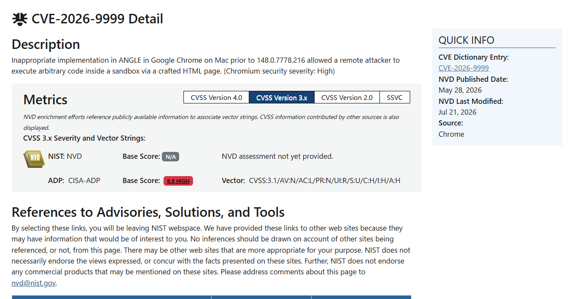
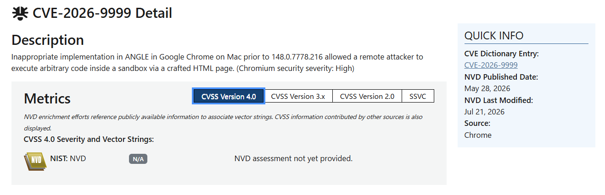

# CVSS Basics and the Scoring and Publication Process

Published: September 8, 2026

## Introduction

Vulnerability information often includes scores and severity ratings such as
"CVSS 8.8" and "Critical." To use this information, you need to understand
what the numbers mean, who assessed the vulnerability, which criteria they
used, and where the results are published.

This article explains what CVSS means, how to interpret scores, the roles of
FIRST, CNAs, and NVD, the process from assessment to publication, and how to
check scores in NVD. It focuses on CVSS v4.0 and also covers differences from
v3.1.

## What is CVSS?

CVSS stands for **Common Vulnerability Scoring System**. It uses a common set
of criteria to assess factors such as how easily a vulnerability can be
exploited and the impact of successful exploitation. It expresses technical
severity as a score from 0.0 to 10.0.

In v3.x and v4.0, scores correspond to the following severity ratings:

| Score | Severity |
| --- | --- |
| 0.0 | None |
| 0.1–3.9 | Low |
| 4.0–6.9 | Medium |
| 7.0–8.9 | High |
| 9.0–10.0 | Critical |

CVSS does not directly express the probability that a vulnerability will be
exploited. The Base assessment commonly published for a vulnerability also
does not determine its remediation priority in your environment. CVSS has
mechanisms for incorporating environmental conditions and exploitation
status, but it cannot replace a complete risk assessment that also considers
factors such as business losses.
[FIRST: CVSS v4.0 Specification](https://www.first.org/cvss/v4.0/specification-document)

## Roles of FIRST, CNAs, and NVD

The organizations that maintain the CVSS specification and those that assess
and publish information about individual vulnerabilities have the following
roles:

| Organization or system | Role related to CVSS |
| --- | --- |
| FIRST | Maintains the CVSS specification; its CVSS SIG handles revisions and improvements |
| CNA (CVE Numbering Authority) | Assigns CVE IDs within its scope and publishes CVE Records, which may include CVSS assessments |
| NVD (National Vulnerability Database) | A vulnerability database operated by the U.S. National Institute of Standards and Technology (NIST) that adds information such as CVSS assessments to CVE information |

FIRST is an international nonprofit organization whose members include
incident response teams from around the world. It is separate from NIST,
which operates NVD; NVD is not part of FIRST.

FIRST maintains the assessment rules, while vendors, CNAs, NVD, and others
use those rules to assess vulnerabilities. FIRST does not score every CVE.
[FIRST: CVSS SIG](https://www.first.org/cvss/),
[NVD: Vulnerability Metrics](https://nvd.nist.gov/vuln-metrics/cvss)

## How CVSS assessments are scored and published

A CNA may include a CVSS assessment in a CVE Record, while NVD or another
organization may publish its own assessment.

### When a CNA includes an assessment in a CVE Record

A typical process is:

1. A vendor or assessor investigates the conditions required to exploit the
   vulnerability and the resulting impact.
2. The assessor selects values for the metrics in the chosen CVSS version
   and calculates the score.
3. The CNA includes the score and vector string, which records the CVSS
   version and metric values, in the CVE Record and submits and publishes it
   through the process specified by the CVE Program.

The system that handles these submissions is **CVE Services**. The production
API host listed in its official repository is `cveawg.mitre.org`. Scores and
vector strings are included as part of the CVE information.
[CVE Services: API Documentation](https://github.com/CVEProject/cve-services#api-documentation)

Published CVE Records are also available in JSON format in
[CVEProject/cvelistV5](https://github.com/CVEProject/cvelistV5) on GitHub.
This repository distributes public data; it is distinct from the normal
submission channel used by CNAs.

Sections 4.5.1.2 and 4.5.5.1 of the CNA Operational Rules require records to be
submitted and published using the specified procedures and formats. However,
the rules do not list CVSS as a required field. Assigning a CVE ID does not
guarantee that a CVSS score will also be published.
[CNA Operational Rules](https://www.cve.org/ResourcesSupport/AllResources/CNARules)

### When NVD provides an assessment

NVD performs its own CVSS assessments using published CVEs and related public
information. The results are published in NVD and may appear alongside
assessments provided by other organizations.

According to NVD's documentation, NVD provides Base assessments; it does not
provide Temporal, Threat, Environmental, or Supplemental assessments. It
does provide calculators that users can use for additional assessments.
[NVD: Vulnerability Metrics](https://nvd.nist.gov/vuln-metrics/cvss)

A score displayed on an NVD page is therefore not necessarily an assessment
performed by NVD. Check the assessment source as well as the number.

## Calculation methods and earlier specifications

CVSS metrics and calculation methods are public. The v3.1 specification
describes metric weights, formulas, and rounding. V4.0 uses a different
method: a score lookup table for combinations of assessments grouped into
MacroVectors, together with an interpolation procedure.
[CVSS v3.1 Specification](https://www.first.org/cvss/v3.1/specification-document),
[CVSS v4.0 Specification](https://www.first.org/cvss/v4.0/specification-document)

Earlier specifications are also available on FIRST's official website.

| Version | Official documentation |
| --- | --- |
| v1 | [Complete CVSS v1 Guide](https://www.first.org/cvss/v1/guide) |
| v2 | [CVSS v2 Complete Documentation](https://www.first.org/cvss/v2/guide) |
| v3.0 | [CVSS v3.0 Specification Document](https://www.first.org/cvss/v3.0/specification-document) |
| v3.1 | [CVSS v3.1 Specification Document](https://www.first.org/cvss/v3.1/specification-document) |
| v4.0 | [CVSS v4.0 Specification Document](https://www.first.org/cvss/v4.0/specification-document) |

Using the same metric values with the same version produces the same score.
However, choosing those values involves judgment about issues such as the
privileges required for an attack and the extent of the impact. Even with
common calculation rules, different assessors may select different values
and produce different scores.

## CVSS v4.0 metric groups

CVSS v3.1 has three metric groups: Base, Temporal, and Environmental. V4.0
has the following four groups:

| Metric group | What it assesses |
| --- | --- |
| Base | Characteristics intrinsic to the vulnerability, such as attack vector, required privileges, user interaction, and the impact of exploitation |
| Threat | Conditions that change over time, such as the availability of proof-of-concept (PoC) code and actual exploitation |
| Environmental | Factors specific to the user's environment, such as defensive measures and the importance of confidentiality, integrity, and availability |
| Supplemental | Additional context, such as whether attacks can be automated and how easily recovery is possible; these metrics do not affect the numerical score |

These are not four independent scores that are added together. The Base
assessment forms the foundation, with Threat and Environmental assessments
incorporated into the score.
[FIRST: CVSS v4.0 Specification](https://www.first.org/cvss/v4.0/specification-document)

### Score notation and metric groups

The following notation distinguishes which metric groups have been assessed:

| Notation | Explicitly assessed groups |
| --- | --- |
| CVSS-B | Base |
| CVSS-BT | Base + Threat |
| CVSS-BE | Base + Environmental |
| CVSS-BTE | Base + Threat + Environmental |

When Threat or Environmental metrics are not specified, the calculation
still uses defaults defined in the specification. An unspecified value does
not mean that there is no threat. Users can incorporate their environment
and exploitation status into a published Base assessment to make it more
useful for response decisions.
[FIRST: CVSS v4.0 User Guide](https://www.first.org/cvss/v4.0/user-guide),
[Specification: Nomenclature](https://www.first.org/cvss/v4.0/specification-document#Nomenclature)

## How to check scores in NVD

Individual CVSS assessments are available from
[NVD](https://nvd.nist.gov/vuln/search),
[JVN iPedia](https://jvndb.jvn.jp/), and product vendors' security advisories.

The following example uses the
[NVD detail page for CVE-2026-9999](https://nvd.nist.gov/vuln/detail/CVE-2026-9999)
to explain how to check a score and its assessment details. The screenshots
show the page when they were captured; the published information may change.

### Check the CVSS version, assessment source, and score

Open the CVE detail page and select the **CVSS Version 3.x** tab in the
**Metrics** section.



The upper row shows **NIST: NVD**, while the lower row shows
**ADP: CISA-ADP**. Check the assessment source and **Base Score** in each row.

| Assessment source | Base Score displayed | Meaning |
| --- | --- | --- |
| NIST: NVD | N/A | NVD's own assessment has not been published |
| ADP: CISA-ADP | 8.8 HIGH | CISA-ADP's Base Score is 8.8, with a High severity rating |

Even when the NIST: NVD row shows N/A, a score from another source may be
available, as in this example. N/A does not mean a score of zero or that the
vulnerability is safe; it means that no assessment value is available in
that field.

### Check the vector string next to the score

In the CISA-ADP row of the same screenshot, **Vector** appears to the right of
**8.8 HIGH**. The text beside it is the vector string, which records the CVSS
version and the values selected for each metric.

The score expresses severity as a number, while the vector string describes
the attack conditions and impact underlying that score. The screenshot shows
the following string:

```text
CVSS:3.1/AV:N/AC:L/PR:N/UI:R/S:U/C:H/I:H/A:H
```

The `CVSS:3.1` prefix identifies an assessment using v3.1. The remaining
components are separated by `/`, with each written as `metric:value`.
The components in this example mean:

| Component | Meaning in this example |
| --- | --- |
| `CVSS:3.1` | Assessed using v3.1 |
| `AV:N` | Exploitation is possible over a network |
| `AC:L` | Attack complexity is Low |
| `PR:N` | No privileges are required before the attack |
| `UI:R` | Interaction by a user other than the attacker is required |
| `S:U` | The impact remains within the same security authority |
| `C:H` | High impact on confidentiality |
| `I:H` | High impact on integrity |
| `A:H` | High impact on availability |

For example, `AV:N`, `PR:N`, and `UI:R` indicate that exploitation is possible
over a network without prior privileges, but requires another user's
interaction. These details describe attack conditions that the number alone
does not convey.

The descriptions here are simplified. Detailed assessment criteria are
available in the
[v3.1 specification](https://www.first.org/cvss/v3.1/specification-document).
V4.0 uses different metrics, so this string cannot be converted by simply
changing the version prefix to `4.0`.

### Check assessments for another version

Select the **CVSS Version 4.0** tab in the same **Metrics** section.



This screenshot shows **N/A** and **NVD assessment not yet provided.** in the
NIST: NVD row. No v4.0 score is listed.

CVSS versions differ in their metrics and calculation methods. Publishing a
v3.1 score does not automatically produce a v4.0 score.

An assessment using v4.0 requires the information needed for that
specification and a separate scoring process. Not every CVE has a score for
every version.
[FIRST: CVSS v4.0 User Guide](https://www.first.org/cvss/v4.0/user-guide)

When comparing scores, check the version, assessment source, and whether the
score is a Base assessment or incorporates additional metric groups.

## Relationship between CVSS and the KEV Catalog

Calculating a CVSS score and adding a vulnerability to the KEV Catalog are
separate processes. CISA's KEV Catalog lists vulnerabilities exploited in
real-world attacks; it is not a calculated score.
[CISA: KEV Data](https://github.com/cisagov/kev-data)

A high CVSS score alone does not qualify a vulnerability for inclusion in
the KEV Catalog. Conversely, absence from the catalog does not prove that a
vulnerability has not been exploited.

The v4.0 Threat assessment also reflects exploitation status, but it is part
of the CVSS assessment. It is distinct from inclusion in the KEV Catalog
managed by CISA.
[FIRST: CVSS v4.0 Specification](https://www.first.org/cvss/v4.0/specification-document)

## Summary

CVSS assesses the technical severity of vulnerabilities using a common set
of criteria.

- FIRST maintains the specification, while vendors, CNAs, NVD, and others
  assess individual vulnerabilities.
- Assessments are published in CVE Records, NVD, and other sources.
- Metrics and calculation methods are public, and earlier specifications
  remain available.
- V4.0 has four metric groups: Base, Threat, Environmental, and Supplemental.
- Check the version, assessment source, and vector string alongside the score.
- N/A in NVD does not mean a score of zero or that a vulnerability is safe.
- CVSS scoring and inclusion in the KEV Catalog are separate processes.

A CVSS number alone does not determine response priority in your environment.
In vulnerability management, review the assumptions behind the assessment
and combine it with information about the impact on your environment and
actual exploitation.

## References

The following sources were reviewed on September 7, 2026. The CNA Operational
Rules and NVD's Vulnerability Metrics were reviewed using text retrieved
from their official pages.

- [FIRST: CVSS SIG](https://www.first.org/cvss/)
- [FIRST: CVSS v4.0 Specification Document](https://www.first.org/cvss/v4.0/specification-document)
- [FIRST: CVSS v4.0 User Guide](https://www.first.org/cvss/v4.0/user-guide)
- [FIRST: CVSS v3.1 Specification Document](https://www.first.org/cvss/v3.1/specification-document)
- [NVD: Vulnerability Metrics](https://nvd.nist.gov/vuln-metrics/cvss)
- [NVD: CVE-2026-9999](https://nvd.nist.gov/vuln/detail/CVE-2026-9999)
- [JVN iPedia](https://jvndb.jvn.jp/)
- [CVE Services: API Documentation](https://github.com/CVEProject/cve-services#api-documentation)
- [CVE Program: CNA Operational Rules](https://www.cve.org/ResourcesSupport/AllResources/CNARules)
- [Official CVE List (GitHub)](https://github.com/CVEProject/cvelistV5)
- [CISA: KEV Data](https://github.com/cisagov/kev-data)

CVSS is owned and managed by FIRST.Org, Inc. and is used in this article
under FIRST's terms of use.

---

KestreLynx is a lightweight, open-source agent that scans images running on a
Docker host and reports vulnerability changes that require attention. It
combines Trivy scan results with CISA KEV and EPSS data to classify findings
into urgent issues and noise.

[Learn more about KestreLynx](../index.md) · [View the source on GitHub](https://github.com/kitsunetrail/kestrelynx)
