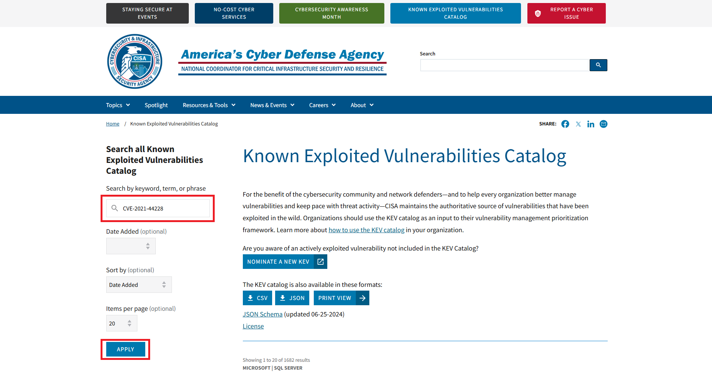
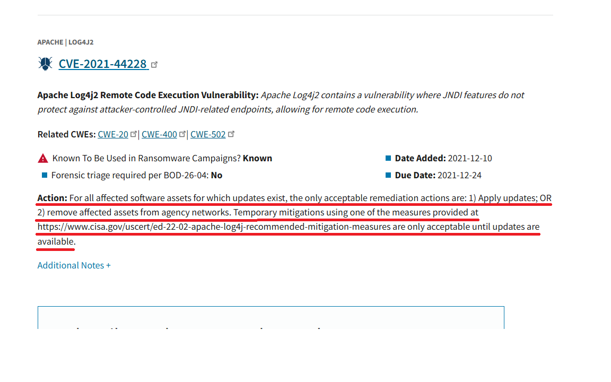

# KEV Catalog Basics and Usage

Published: August 27, 2026

## Introduction

A large number of CVEs are published, and treating every one of them with the
same priority is not practical.

The KEV Catalog, published by the U.S. Cybersecurity and Infrastructure
Security Agency (CISA), helps identify vulnerabilities that are being used in
real-world attacks.

This article explains what KEV means, the criteria for adding a vulnerability
to the KEV Catalog, the data the catalog provides, and how to use it in
vulnerability management.

## What is KEV?

KEV stands for **Known Exploited Vulnerabilities**.

KEV is not a new identifier for a vulnerability. It refers to vulnerabilities
that have been confirmed as exploited in real-world attacks.

## What is the KEV Catalog?

The U.S. Cybersecurity and Infrastructure Security Agency (CISA) maintains the
[Known Exploited Vulnerabilities Catalog (KEV Catalog)](https://www.cisa.gov/known-exploited-vulnerabilities-catalog),
which lists vulnerabilities confirmed as exploited in real-world attacks.

The KEV Catalog contains vulnerabilities that have a CVE ID and for which
there is reliable evidence of exploitation. Entries are organized by CVE ID
and include information such as the affected product and the required action.

Organizations can use the catalog to identify which CVEs already represent a
real-world threat and prioritize their response accordingly.

The KEV Catalog is available through CISA in the following formats:

- [KEV Catalog web page](https://www.cisa.gov/known-exploited-vulnerabilities-catalog)
- [JSON](https://www.cisa.gov/sites/default/files/feeds/known_exploited_vulnerabilities.json)
- [CSV on CISA's official GitHub mirror](https://github.com/cisagov/kev-data/blob/develop/known_exploited_vulnerabilities.csv)

The web page can be searched by CVE ID, product name, or vendor name. The JSON
and CSV files can be imported into vulnerability management tools or matched
automatically against scanner results.

The relationship between CVE and the KEV Catalog can be summarized as follows:

| Item | CVE | KEV Catalog |
| --- | --- | --- |
| Primary purpose | Identify a vulnerability with a common ID | Identify vulnerabilities exploited in real-world attacks |
| Scope | Publicly disclosed vulnerabilities in general | CVEs that meet the catalog's inclusion criteria |
| Managed by | CVE Program | CISA |
| What it tells you | Which vulnerability is being discussed | Whether exploitation in real-world attacks has been confirmed |

The catalog adds the information that exploitation has been confirmed to an
existing CVE.

## Criteria for inclusion in the KEV Catalog

CISA specifies three criteria for adding a vulnerability to the KEV Catalog:

1. The vulnerability has an assigned CVE ID.
2. There is reliable evidence that the vulnerability has been actively exploited.
3. There is a clear remediation action for the vulnerability.

A vulnerability must meet all three criteria to be considered for inclusion.

### 1. The vulnerability has an assigned CVE ID

Because the KEV Catalog is organized around CVEs, a vulnerability must have a
CVE ID.

Even when a vulnerability is being exploited, it does not meet the catalog's
criteria until a CVE ID has been assigned.

### 2. There is evidence of active exploitation

CISA's definition of active exploitation includes not only successful
exploitation but also attempts by an attacker to exploit a vulnerability in a
real-world environment. Potential evidence includes:

- Logs or forensic information from a compromised system
- Exploitation attempts observed by a honeypot or similar system
- Use by malware or ransomware
- Attacks confirmed by a vendor or security company
- Records showing that an attacker sent or executed exploit code against a target system

The following information alone is not treated as evidence of active
exploitation:

- A proof of concept (PoC) has been published
- A researcher reproduced the vulnerability in a test environment
- Scanning for vulnerable systems has been observed
- The vulnerability is considered technically exploitable

A published PoC is important because it can increase the risk of future
exploitation. By itself, however, it does not prove that an attacker exploited
the vulnerability in a real-world environment.

CISA evaluates evidence from sources such as incident response activities,
government agencies, product vendors, security companies, and researchers.
Information about affected organizations or the specific evidence may not be
published because of confidentiality or source-protection concerns.

### 3. There is a clear remediation action

For a vulnerability to be added to the KEV Catalog, there must also be a
specific action that affected organizations can take. Examples include:

- Updating to a fixed version
- Applying a vendor-provided patch
- Disabling the affected feature or service
- Mitigating the issue through configuration changes or access restrictions
- Applying a vendor-provided workaround
- Discontinuing or replacing the product when no effective mitigation is available

General advice such as "use caution" or "increase monitoring" is not a
specific procedure for fixing or mitigating a vulnerability. Users must be
given a clear action to perform.

## How to nominate a vulnerability

Anyone can report a candidate for inclusion in the KEV Catalog to CISA, not
only product vendors and security companies.

Use "Nominate a New KEV" on the
[KEV Catalog page](https://www.cisa.gov/known-exploited-vulnerabilities-catalog)
to submit the candidate vulnerability and evidence of exploitation.

Submission does not guarantee that the vulnerability will be added. CISA
reviews the information, conducts further investigation when necessary, and
adds the vulnerability only if it determines that all inclusion criteria are
met.

Nominating a vulnerability for the KEV Catalog is also different from
requesting a CVE ID for a new vulnerability. If the vulnerability does not yet
have a CVE ID, one must first be assigned through the appropriate CNA or
another CVE Program process.

## Key data fields in the KEV Catalog

The JSON feed contains catalog-level metadata and an array of vulnerability
entries. Its structure can be simplified as follows:

```json
{
  "title": "CISA Catalog of Known Exploited Vulnerabilities",
  "catalogVersion": "...",
  "dateReleased": "...",
  "count": 0,
  "vulnerabilities": [
    {
      "cveID": "CVE-YYYY-NNNN",
      "vendorProject": "Example Vendor",
      "product": "Example Product",
      "vulnerabilityName": "Example Vulnerability",
      "dateAdded": "YYYY-MM-DD",
      "shortDescription": "...",
      "requiredAction": "...",
      "dueDate": "YYYY-MM-DD",
      "knownRansomwareCampaignUse": "Unknown",
      "notes": "...",
      "cwes": ["CWE-NNN"]
    }
  ]
}
```

The main fields for each vulnerability are:

| Field | Description |
| --- | --- |
| `cveID` | CVE ID |
| `vendorProject` | Vendor or project name |
| `product` | Affected product |
| `vulnerabilityName` | Vulnerability name |
| `dateAdded` | Date added to the KEV Catalog |
| `shortDescription` | Vulnerability summary |
| `requiredAction` | Required action |
| `dueDate` | Remediation deadline for U.S. federal civilian executive branch agencies |
| `knownRansomwareCampaignUse` | Whether use in ransomware campaigns is known |
| `notes` | References such as vendor information |
| `cwes` | CWE identifiers describing the type of vulnerability |

The `dueDate` is a deadline for U.S. federal civilian executive branch
agencies. It does not by itself impose a legal obligation on individuals or
private-sector organizations, although it can be useful when assessing the
urgency of a response.

## How to use the KEV Catalog

The basic workflow is to determine whether a CVE detected in your environment
appears in the KEV Catalog, then use the catalog entry and the vendor's
official information to decide how to respond.

The following example walks through a manual review after a vulnerability
scanner detects `CVE-2021-44228`.

### Step 1: Confirm the detected CVE ID

Confirm the CVE ID in the vulnerability scanner results. In this example, the
scanner has detected `CVE-2021-44228`, an Apache Log4j2 vulnerability.

### Step 2: Search for the CVE ID in the KEV Catalog

Open [CISA's KEV Catalog](https://www.cisa.gov/known-exploited-vulnerabilities-catalog),
enter `CVE-2021-44228` in "Search by keyword, term, or phrase," and select
"APPLY."



### Step 3: Review the KEV Catalog entry

If `CVE-2021-44228` appears in the results, the vulnerability is included in
the KEV Catalog.

The result identifies the vendor and product as "Apache | Log4j2" and provides
a vulnerability summary, the date it was added to the catalog, and the
remediation deadline for U.S. federal agencies. "Known To Be Used in
Ransomware Campaigns" is set to "Known," indicating that its use in ransomware
campaigns has been confirmed.


### Step 4: Review CISA's required action

The "Action" field in the search result describes the response required by
CISA. For `CVE-2021-44228`, affected assets for which updates exist must be
updated or removed from agency networks. The entry also refers to temporary
mitigations that may be used until updates are available.



The KEV Catalog's "Action" field provides a response policy. To determine the
affected versions and the specific version to install, also consult the
product vendor's official information.

### Step 5: Check the vendor's official information for affected and fixed versions

For this example, consult the
[Apache Logging Services security page](https://logging.apache.org/security.html#CVE-2021-44228)
published by the Apache Software Foundation, which develops the product. This
page was not reached directly through "Additional Notes" in this KEV Catalog
entry. It is vendor information located separately by using the product name
and CVE ID shown in the search result.

The Apache page identifies the affected component and versions, fixed
versions, and mitigations. Compare this information with the version and
configuration in your environment. If your environment is affected, update
the product or apply the necessary mitigation.


For automated use, download the JSON or CSV feed from CISA and match its CVE
IDs against those reported by a vulnerability scanner. When a CVE appears in
the KEV Catalog, its confirmed exploitation can be used to raise the priority
of alerts and remediation.

## Important considerations when using the KEV Catalog

### Absence from the KEV Catalog does not mean a vulnerability is safe

A vulnerability may be absent from the KEV Catalog for reasons other than a
lack of exploitation:

- CISA may not yet be aware of the exploitation
- The reliability of the evidence may still be under review
- A CVE ID or a clear remediation action may not yet exist
- Future exploitation may be possible even though none has been confirmed

Therefore, vulnerabilities not listed in the KEV Catalog should not be
ignored.

### The KEV Catalog does not determine whether your environment is affected

Inclusion in the KEV Catalog means that exploitation of the CVE has been
confirmed. It does not determine whether your particular environment is
affected.

Even when the same product is in use, the impact can depend on its version,
configuration, enabled features, and exposure to the internet. The final
determination requires checking the vendor advisory and the state of your own
environment.

## Summary

The KEV Catalog has the following characteristics:

- It is a CISA-maintained list of vulnerabilities exploited in real-world attacks.
- An entry must have a CVE ID, evidence of exploitation, and a clear remediation action.
- A published PoC or scanning for vulnerable devices alone is not evidence of exploitation.
- Anyone can nominate a candidate vulnerability to CISA.
- The catalog is available as a web page and in JSON and CSV formats.
- Matching the catalog against scanner results helps prioritize remediation.
- Absence from the KEV Catalog does not mean that a vulnerability is safe.

Where CVE provides a common ID for identifying a vulnerability, the KEV
Catalog helps determine whether that vulnerability has been used in real-world
attacks.

When a large number of vulnerabilities compete for attention, the KEV Catalog
is a useful source for prioritization. It should not be used in isolation;
consider the impact on your environment, CVSS, EPSS, and the availability of a
fix as well.

## References

The following sources were reviewed on August 27, 2026.

- [CISA: Known Exploited Vulnerabilities Catalog](https://www.cisa.gov/known-exploited-vulnerabilities-catalog)
- [CISA: Reducing the Significant Risk of Known Exploited Vulnerabilities](https://www.cisa.gov/known-exploited-vulnerabilities-catalog/reducing-significant-risk-known-exploited-vulnerabilities)
- [CISA: KEV Catalog JSON](https://www.cisa.gov/sites/default/files/feeds/known_exploited_vulnerabilities.json)
- [CISA: KEV Catalog CSV (GitHub mirror)](https://github.com/cisagov/kev-data/blob/develop/known_exploited_vulnerabilities.csv)

---

KestreLynx is a lightweight, open-source agent that scans images running on a
Docker host and reports vulnerability changes that require attention. It
combines Trivy scan results with CISA KEV and EPSS data to classify findings
into urgent issues and noise.

[Learn more about KestreLynx](../index.md) · [View the source on GitHub](https://github.com/kitsunetrail/kestrelynx)
